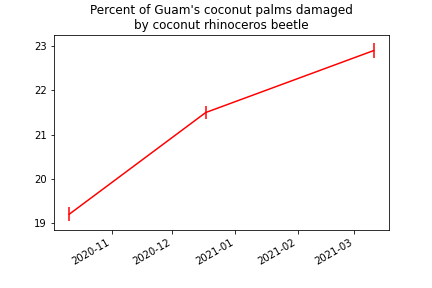

`Link text <https://domain.invalid/>`_ 

Guam-CRB-Damage-Map-2021-03
===========================

This repository stores an `online interactive map of coconut rhinoceros damage on Guam <https://aubreymoore.github.io/Guam-CRB-Damage-Map-2021-03>`_ created using data from automated image analysis of roadside video surveys performed during March 2021. For a nontechnical overview of the survey method see the `WPTRC 2020 Impact Report <https://www.uog.edu/_resources/files/wptrc/2020WPTRCFinal.pdf>`_, pages 7-10.

A QGIS project and SpatiaLite database for making the map are stored in `Guam03.qgz <Guam03.qgz>`_ and `Guam03.zip <Guam03.zip>`_.
Note that you will need to unzip **Guam03.zip** after downloading. It contains **Guam03.db**.

Previous Guam CRB Damage Maps
-----------------------------

* `Oct 2020 <https://aubreymoore.github.io/new-crb-damage-map/>`_
* `Dec 2020 <https://aubreymoore.github.io/Guam-CRB-damage-map-2020-12/webmap/v1/>`_

Timeline Plot
-------------

